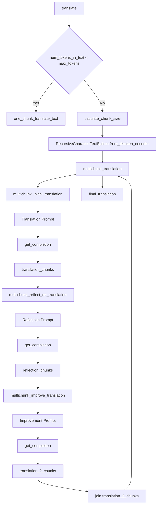

## docs agent

借用多段翻译的思路处理STT文本， 并输出成最终稿；

### GPTs 实现

https://chatgpt.com/g/g-uBhKUJJTl-ke-ji-wen-zhang-fan-yi

### 代码实现

借用了[translation-agent](https://github.com/andrewyng/translation-agent/tree/main)

其逻辑：

